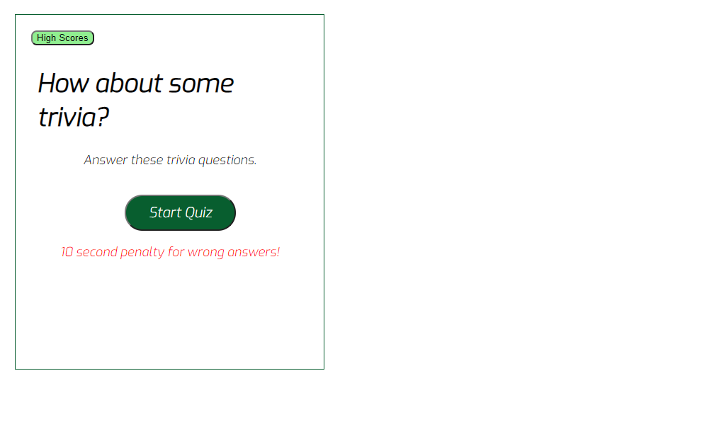
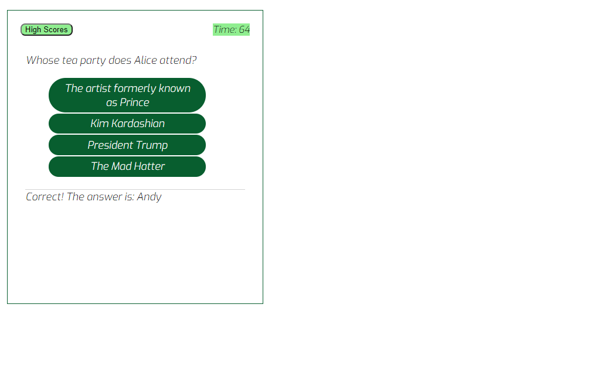
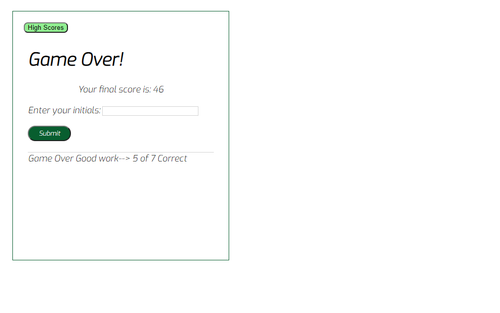
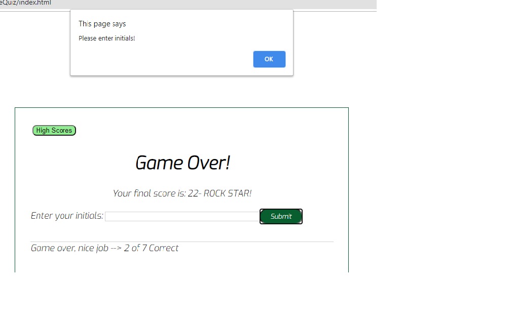
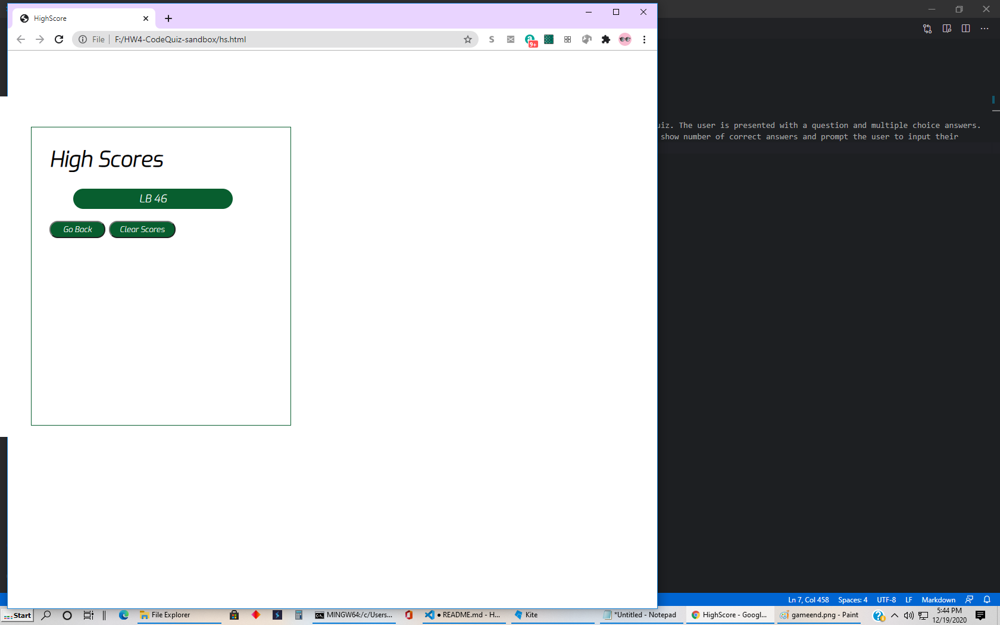

# HW4-CodeQuiz

Quiz Code - Deployed Application https://leskbook.github.io/HW4-CodeQuiz/

**Assignment Objective:**

Using a combination of HTML, CSS and javascript this task is meant to present a user with an interactive quiz. The user is presented with a question and multiple choice answers. A timer begins when the quiz is started and a countdown timer is used to time the quiz. The results should show number of correct answers and prompt the user to input their initials so progress results can be tracked. There is a 10 point/seconds reduction for incorrect answers. 
A link to the High Scores records is available. The scores should remain until the browser is closed.

**Coding Expectations**
In order to simplify my javascript I used individual scripts for my quiz page and my high scores page. This allowed me to methodically break down the separate functions for each page but retail the anchored link between the two pages. I utilized one css for both pages to ensure aesthetic consistency. 

**Acceptance Criteria**

- GIVEN I am taking a code quiz
- WHEN I click the start button
- THEN a timer starts and I am presented with a question
- WHEN I answer a question
- THEN I am presented with another question
- WHEN I answer a question incorrectly
- THEN time is subtracted from the clock
- WHEN all questions are answered or the timer reaches 0
- THEN the game is over
- WHEN the game is over
- THEN I can save my initials and score

**Start the quiz**

**Select the correct answer**

The game ends when time runs out or all the questions are completed. At that time the player is asked to imput their initials.

**The player is prompted if they don't input initials**

When the player clicks on High Scores previous scores are displayed with the option to clear or go back to take the quiz again.

The high score is maintained in the local database until the browser is closed. 

